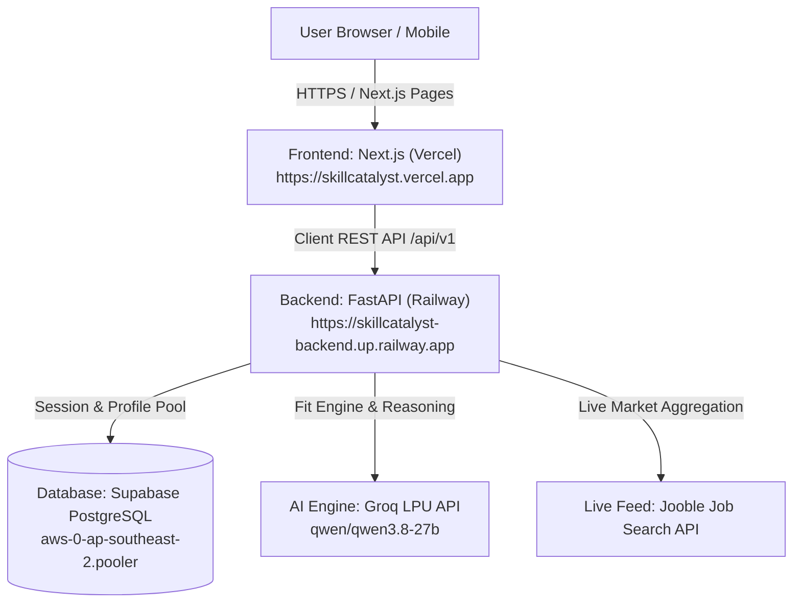

# 🚀 SkillCatalyst Production Deployment Guide
## Deploying Backend to Railway & Frontend to Vercel

This production deployment guide covers the zero-downtime, continuous deployment pipeline for **SkillCatalyst**:
- **Backend**: FastAPI 0.110+ on [Railway](https://railway.app) via Docker container.
- **Frontend**: Next.js 16 (App Router + React 19) on [Vercel](https://vercel.com).
- **Database**: Cloud PostgreSQL via [Supabase](https://supabase.com).
- **AI / External APIs**: Groq LPU (Qwen 3.8 27B) & Jooble Global Job Feed.

---



---

## 📋 Deployment Order (Critical)

> [!IMPORTANT]
> **Always deploy the Backend to Railway FIRST**:
> 1. Deploying Railway first provides you with a live HTTPS production URL (e.g. `https://skillcatalyst-backend.up.railway.app`).
> 2. You will then input this URL into Vercel's `NEXT_PUBLIC_API_URL` environment variable during Frontend deployment.

---

## Part 1: Deploy Backend to Railway

Railway automatically builds and runs the backend using the root [`Dockerfile`](Dockerfile) and [`railway.json`](railway.json).

### Step 1.1: Push Latest Changes to GitHub
Make sure all repository changes are pushed to your GitHub repository:
```bash
git add .
git commit -m "Configure production deployment for Railway and Vercel"
git push origin main
```

### Step 1.2: Create a New Project on Railway
1. Go to [railway.app](https://railway.app) and sign in with GitHub.
2. Click **"+ New Project"**.
3. Select **"Deploy from GitHub repo"**.
4. Choose your repository: `palamooradithyagoud/global-hackathon` (or your repository fork).

### Step 1.3: Configure Build Settings
Railway will detect the root [`railway.json`](railway.json) and [`Dockerfile`](Dockerfile) automatically.
- **Builder**: `Dockerfile` (declared in `railway.json`).
- **Root Directory**: Leave as default (`/`).
- *(Alternative)*: If you ever set Railway Root Directory to `/backend`, the project also includes [`backend/Dockerfile`](backend/Dockerfile) which handles that mode seamlessly.

### Step 1.4: Add Production Environment Variables
In your Railway project service view, navigate to the **"Variables"** tab and add:

| Variable Name | Example / Production Value | Description |
| :--- | :--- | :--- |
| `DATABASE_URL` | `postgresql://postgres.[REF]:[PASS]@[POOLER].supabase.com:5432/postgres` | Supabase connection string with session pooler |
| `ENVIRONMENT` | `production` | Production environment flag |
| `GROQ_API_KEY` | `gsk_...` | Groq API Key for AI profile extraction & fit scoring |
| `GROQ_MODEL` | `qwen/qwen3.8-27b` | AI model identifier |
| `JOOBLE_API_KEY` | `your_jooble_api_key_here` | Jooble API Key for live jobs |
| `JOOBLE_API_URL` | `https://jooble.org/api` | Jooble API Base Endpoint |
| `YOUTUBE_API_KEY` | `your_youtube_api_key_here` | YouTube Data API v3 Key for playlists & lectures |

> [!NOTE]
> `PORT` is automatically generated and injected by Railway at runtime. The Dockerfile and `railway.json` automatically bind uvicorn to `0.0.0.0:$PORT`.

### Step 1.5: Generate Public Domain
1. In your Railway Service, go to the **"Settings"** tab.
2. Scroll to the **"Networking"** section.
3. Under **"Public Networking"**, click **"Generate Domain"** (or bind a custom domain).
4. Note your backend URL (e.g. `https://skillcatalyst-backend.up.railway.app`).

### Step 1.6: Verify Backend Health
Open a browser or run curl to test your backend:
```bash
curl https://<your-railway-domain>/health
```
Expected response:
```json
{
  "status": "healthy",
  "service": "SkillCatalyst Intelligence API",
  "environment": "production",
  "database": "connected"
}
```
You can also visit `https://<your-railway-domain>/docs` to view the interactive FastAPI Swagger UI.

---

## Part 2: Deploy Frontend to Vercel

Vercel provides instant global CDN edge hosting for Next.js 16 with automatic preview branches.

### Step 2.1: Import Project in Vercel
1. Log in to [vercel.com](https://vercel.com) with GitHub.
2. Click **"Add New..."** -> **"Project"**.
3. Select your repository `palamooradithyagoud/global-hackathon`.

### Step 2.2: Configure Root Directory
In the **Configure Project** screen:
1. Click **"Edit"** next to **Root Directory**.
2. Select or enter: `frontend`
3. Click **"Continue"**.

### Step 2.3: Verify Build Settings
Vercel automatically detects Next.js:
- **Framework Preset**: `Next.js`
- **Build Command**: `next build`
- **Output Directory**: `.next`
- **Install Command**: `npm install`

### Step 2.4: Set Environment Variables
Expand the **Environment Variables** section and add:

| Key | Value | Notes |
| :--- | :--- | :--- |
| `NEXT_PUBLIC_API_URL` | `https://<your-railway-domain>/api/v1` | Your live Railway backend URL from Part 1 |

> [!TIP]
> The frontend client in [`frontend/src/lib/api.ts`](frontend/src/lib/api.ts) automatically normalizes `NEXT_PUBLIC_API_URL`. Both `https://skillcatalyst-backend.up.railway.app` and `https://skillcatalyst-backend.up.railway.app/api/v1` are accepted seamlessly.

### Step 2.5: Click Deploy
Click **"Deploy"**. Vercel will build the Next.js production bundle and provision an HTTPS domain (e.g., `https://skillcatalyst.vercel.app`).

---

## Part 3: CORS Configuration (Zero-Config)

The FastAPI backend is pre-configured with dynamic regex matching in [`backend/app/main.py`](backend/app/main.py):
```python
app.add_middleware(
    CORSMiddleware,
    allow_origins=settings.CORS_ORIGINS if isinstance(settings.CORS_ORIGINS, list) else ["*"],
    allow_origin_regex=r"^https://.*\.vercel\.app$",
    allow_credentials=True,
    allow_methods=["*"],
    allow_headers=["*"],
)
```
This means:
- All production deployments on `*.vercel.app` work immediately without manual CORS edits.
- All dynamic preview branch URLs (e.g. `https://skillcatalyst-git-feat-xyz.vercel.app`) are authorized automatically.
- If you add a custom apex domain (e.g. `https://skillcatalyst.com`), simply add it to Railway's `CORS_ORIGINS` variable as a comma-separated list: `https://skillcatalyst.com,https://www.skillcatalyst.com`.

---

## Part 4: End-to-End Production Verification

Run through this smoke test checklist on your live Vercel domain:

| Test Case | Steps | Expected Result |
| :--- | :--- | :--- |
| **1. Landing Page** | Visit `/` | Hero section, dynamic stats counter, and CTA buttons load instantly |
| **2. Demo Authentication** | Visit `/login`, click "One-Click Demo Student Login" | Generates session token, stores user, redirects to `/dashboard` |
| **3. Full Onboarding Flow** | Visit `/onboarding`, complete academic profile, upload resume PDF | Resume is parsed, structured data saved in Supabase |
| **4. Scholarship Discovery** | Visit `/scholarships` | Curated scholarships for student's education stage render with eligibility metrics |
| **5. Live Jooble Job Engine** | Visit `/jobs` | Live Indian market jobs display with AI Fit Scores, skill matches, and gap analysis |
| **6. Health & Docs** | Visit `https://<backend>/health` and `/docs` | Health returns status 200, Swagger UI allows live endpoint interaction |

---

## Part 5: Troubleshooting & FAQ

### Q1: The frontend shows "Unable to communicate with the intelligence backend"
- Verify that your Railway service is active and `health` returns 200.
- Check that `NEXT_PUBLIC_API_URL` is set in Vercel under **Project Settings -> Environment Variables**.
- If you updated `NEXT_PUBLIC_API_URL` in Vercel, trigger a **Redeploy** (Deployments -> ... -> Redeploy) so Next.js bakes the public environment variable into the client bundle.

### Q2: Railway deployment shows `Database connection error`
- Ensure your Supabase database is active and not paused.
- In Supabase, use the **Transaction Pooler** connection string (port `6543`) or **Session Pooler** (port `5432`).
- Check that your password does not contain unescaped characters (or use URL encoding, e.g., `%40` for `@`).

### Q3: Railway build times out or fails on `pip install`
- Railway caches pip dependencies between builds. The root [`Dockerfile`](Dockerfile) copies only `backend/requirements.txt` first to leverage Docker layer caching.
- System dependencies are minimized (`curl` only) for sub-2 minute container builds.
